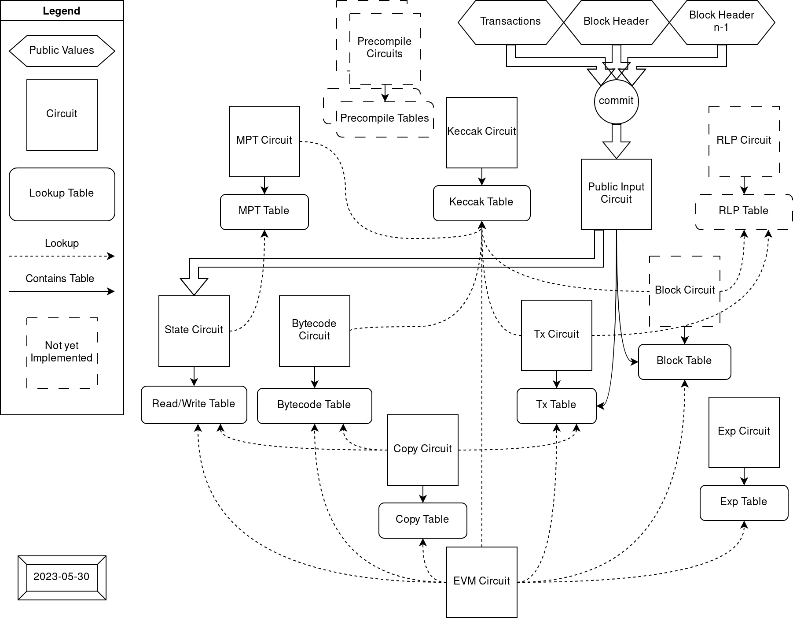

# Architecture

<!-- toc -->

# Concepts

## Architecture diagram

Each circuit is layouted to be capable to build their own custom constraints. When circuits encounter some expensive operations, they can outsource the effort to other circuits through the usage of lookup arguments. 
The relationship between circuits looks like:

List of circuits and tables they generate/verify:

| Circuit                                                | Table                                                                                                  |
| ---                                                    | ---                                                                                                    |
| [EVM Circuit](./architecture/evm-circuit.md)           |                                                                                                        |
| [Bytecode Circuit](./architecture/bytecode-circuit.md) | [Bytecode Table](https://github.com/appliedzkp/zkevm-specs/blob/master/specs/tables.md#bytecode_table) |
| [State Circuit](./architecture/state-circuit.md)       | [Rw Table](https://github.com/appliedzkp/zkevm-specs/blob/master/specs/tables.md#rw_table)             |
| Block Circuit                                          | [Block Table](https://github.com/appliedzkp/zkevm-specs/blob/master/specs/tables.md#block_table)       |
| [Tx Circuit](./architecture/tx-circuit.md)             | [Tx Table](https://github.com/appliedzkp/zkevm-specs/blob/master/specs/tables.md#tx_table)             |
| [MPT Circuit](./architecture/mpt-circuit.md)           | MPT Table                                                                                              |
| [Keccak Circuit](./architecture/keccak-circuit.md)     | Keccak Table                                                                                           |
| [ECDSA Circuit](./architecture/ecdsa-circuit.md)       | ECDSA Table                                                                                            |

In the end, the circuits would be assembled depending on their dimension and the desired capacity. For example, we can just combine 2 different circuits by using different columns, or stack them using same columns with extra selectors.

In order to reduce the time required to build a proof of a full block and to
simplify the verification step, an aggregation circuit is being build so that condenses the
 verification of each sub-circuit proofs shown in the diagram.  See [Design
Notes, Recursion](./design/recursion.md) for details on the recursion strategy
used in the aggregation circuit.

## Circuit as a lookup table

In halo2, the lookup is flexible to be configured. Anything able to be turned into `Expression` could be used as `item: Tuple[int, ...]` or `table: Set[Tuple[int, ...]]` in lookup. Enabling `assert item in table`. The `Expression` includes `Constant`, `Fixed`, `Advice` or `Instance` column at arbitrary rotation.

The motivation to have multiple circuits as lookup tables is that EVM contains many circuit unfriendly operations like random read-write data access, "wrong" field operation (ECDSA on secp256k1), traditional hash functions like `keccak256`, etc... And many of them accept variable lenght input.

These expensive operations make it hard to design an EVM circuit to verify computation traces because each step could possibly contain some of the operations mentioned above. So we tried to separate these expensive operations into single-purpose circuits which have a more friendly layout, and use them via lookups to communicate it's input and output, Outsourcing the effort.

The reason input-output lookups could be used to outsource the effort is that we know the that the lookup-ed table is configured with constraints to verify the input and output are in some relationship. For example, we let Bytecode circuit to hold a set of tuple `(code_hash, index, opcode)`, and each `code_hash` is verified to be the keccak256 digest of opcodes it contains, then in EVM circuit we can load `opcode` with `(code_hash, program_counter)` by looking up the Bytecode table.

However, there are some properties we can't ensure only with lookups (which ultimately only prove that the contents of all the lookups are a subset of a table).  We want to constraint that the amount of all (looked-up) `item`s should be equal to the size of `table`, which is required by the EVM circuit and State circuit to prevent extra malicious writes in the `table`. In such case (the set of looked up items define the table exactly), we need some extra constraint to ensure the relationship is correct. A naive approach is to count all `item` in State circuit (which in the end is the size of the `table`) and constraint it to be equal to the value counted in the EVM circuit.

## EVM word encoding

See [Design Notes, Random Linear Combination](./design/random-linear-combinaion.md)

- [Word encoding spec](https://github.com/appliedzkp/zkevm-specs/blob/master/specs/word-encoding.md)

# Custom types

# Constants

| Name                 | Value        | Description                     |
| -------------------- | ------------ | ------------------------------- |
| `MAX_MEMORY_ADDRESS` | `2**40 - 1`  | max memory address allowed [^1] |
| `MAX_GAS`            | `2**64 - 1`  | max gas allowed                 |
| `MAX_ETHER`          | `2**256 - 1` | max value of ether allowed [^2] |

[^1]: The explicit max memory address in EVM is actually `32 * (2**32 - 1)`, which is the one that doesn't make memory expansion gas cost overflow `u64`. In our case, memory address is allowed to be 5 bytes, but will constrain the memory expansion gas cost to fit `u64` in success case.

[^2]: I didn't find a explicit upper bound on value of ether (for `balance` or `gas_price`) in yellow paper, but handling unbounded big integer seems unrealistic in circuit, so with `u256` as a hard bound seems reasonable.
