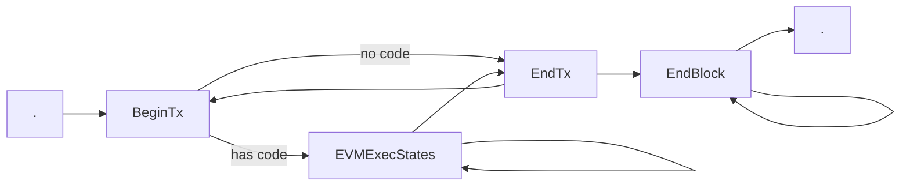
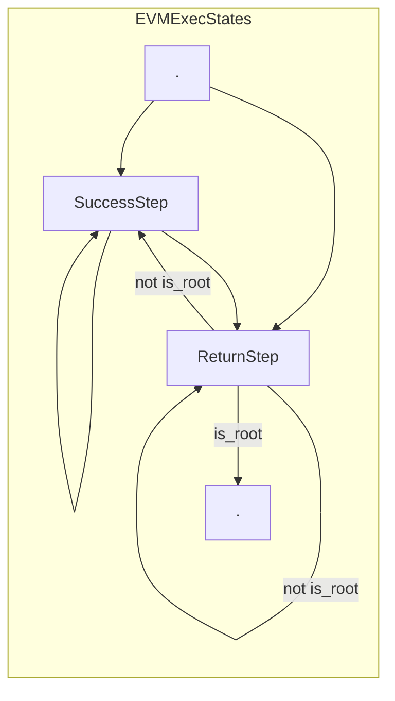
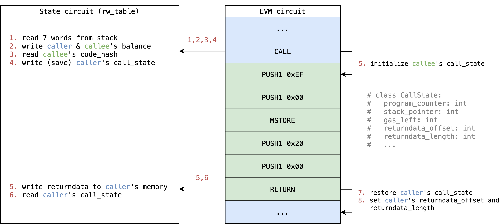

# EVM Circuit

<!-- toc -->

# Introduction

EVM circuit iterates over transactions included in the proof to verify that each execution step of a transaction is valid. Each iteration handles one opcode per step (as is the case in the EVM), except opcodes which operate on variable size of memory (such as `SHA3` or `CALLDATACOPY`), which would require multiple "virtual" steps [^1].

In order to verify if a step is valid, we must first enumerate all possible execution results of a step in the EVM - including success and error cases, and then build a custom constraint to verify that the step transition is correct for each execution result.

For each step, we constrain it to enable one of the execution results, and specially, to constrain the first step to enable `BEGIN_TX`, which then repeats the step to verify the full execution trace. Also each step is given access to the next ste in order to propagate the tracking information. This is accomplished by putting constraints like `assert next.program_counter == curr.program_counter + 1`.

# Concepts

## Execution result

One's first intuition may be to have each opcode as a branch in step, however, due to the similarities between opcodes, such as `{ADD,SUB}`, `{PUSH*}`, `{DUP*}` and `{SWAP*}` , we can handle many opcodes in a single branch with minor adjustments.

Each EVM state transition can contain several kinds of error cases, so we need to take them into consideration to be equivalent to EVM, rather than each opcode branch handling its own error cases as that would result in the execution being returned to the caller, thus halting the step. Fortunately, most error cases are easy to verify with a pre-built lookup table, there are some exceptions such as an out of gas error due to dynamic gas usage.

Because of this complexity, we unroll all kinds of error cases as a type of execution result.

This gives us the ability to enumerate [all possible execution results](https://github.com/appliedzkp/zkevm-specs/blob/83ad4ed571e3ada7c18a411075574110dfc5ae5a/src/zkevm_specs/evm/execution_result/execution_result.py#L4) and subsequently represent the EVM circuit as a finite state machine (see below)

- **BeginTx**:
    - Beginning of a transaction.
- **EVMExecStates** = [ SuccessStep | ReturnStep ]
- **SuccessStep** = [ ExecStep | ExecMetaStep | ExecSubStep ]
    - Set of states that succeed and continue the execution within the call.
- **ReturnStep** = [ ExplicitReturn | Error ]
    - Set of states that halt the execution of a call and return to the caller
      or go to the next tx.
- **ExecStep**:
    - 1-1 mapping with a GethExecStep for opcodes that map to a single gadget
      with a single step.  Example: `ADD`, `MUL`, `DIV`, `CREATE2`.
- **ExecMetaStep**:
    - N-1 mapping with a GethExecStep for opcodes that share the same gadget
      (due to similarity) with a single step.  For example `{ADD, SUB}`,
      `{PUSH*}`, `{DUP*}` and `{SWAP*}`.
      A good example on how these are grouped is the `StackOnlyOpcode` struct.
- **ExecSubStep**:
    - 1-N mapping with a GethExecStep for opcodes that deal with dynamic size
      arrays for which multiple steps are generated.
        - `CALLDATACOPY` -> CopyToMemory
        - `RETURNDATACOPY` -> TODO
        - `CODECOPY` -> TODO
        - `EXTCODECOPY` -> IN PROGRESS
        - `SHA3` -> IN PROGRESS
        - `LOGN` -> CopyToLog
- **ExplicitReturn**:
    - 1-1 mapping with a GethExecStep for opcodes that return from a call
      without exception.
- **Error** = [ ErrorEnoughGas | ErrorOutOfGas ]
    - Set of states that are associated with exceptions caused by opcodes.
- **ErrorEnoughGas**:
    - Set of error states that are unrelated to out of gas.  Example:
      `InvalidOpcode`, `StackOverflow`, `InvalidJump`.
- **ErrorOutOfGas**:
    - Set of error states for opcodes that run out of gas. For each opcode
      (sometimes group of opcodes) that has dynamic memory gas usage, there is
      a specific **ErrorOutOfGas** error state.
- **EndTx**
    - End of a transaction.
- **EndBlock**
    - End of a block (serves also as padding for the rest of the state step slots)

> In the current implementation, we ask the opcode implementer to also implement error cases, which seems to be a redundant effort.
> But by doing this, they can focus more on opcode's success case. Also error cases are usually easier to verify, so I think it also reduces the overall implementation complexity.
>
> **han**

## Random access data

In EVM, the interpreter has the ability to do any random access to data like block context, account balance, stack and memory in current scope, etc... Some of these access are read-write and others are read-only.

In EVM circuit, we leverage the concept [Circuit as a lookup table](#Circuit-as-a-lookup-table) to duplicate these random data access to other circuits in a different layout and verify that they are consistent and valid. After these random data access are verified, we can use them just as if they were only tables. [Here](https://github.com/appliedzkp/zkevm-specs/blob/83ad4ed571/src/zkevm_specs/evm/table.py#L108) are the tables currently used in the EVM circuit.

For read-write access data, EVM circuit looks up State circuit with a sequentially `rw_counter` (read-write counter) to make sure the read-write access is chronological. It also uses a flag `is_write` to check data consistency between different write access.

For read-only access data, EVM circuit looks-up Bytecode circuit, Tx circuit and Call circuit directly.

## Reversible write reversion

In EVM, reversible writes can be reverted if any call fails. There are many kinds of reversible writes, a complete list can be found [here](https://github.com/ethereum/go-ethereum/blob/master/core/state/journal.go#L87-L141).

In EVM circuit, each call is attached with a flag (`is_persistent`) to know if it succeeds or not. So ideally, we only need to do reversion on these kinds of reversible writes which affect future execution before reversion:

- `TxAccessListAccount`
- `TxAccessListStorageSlot`
- `AccountNonce`
- `AccountBalance`
- `AccountCodeHash`
- `AccountStorage`

On some others we don't need to do reversion because they don't affect future execution before reversion, we only write them when `is_persistent` is `1`:

- `TxRefund`
- `AccountDestructed`

> Another tag is `TxLog`, which also doesn't affect future execution. It should be explained where to write such record to after we decide where to build receipt trie.
>
> **han**

To enable reversible write reversion, we need some meta information of a call:

1. `is_persistent` - To know if we need reversion or not.
2. `rw_counter_end_of_reversion` - To know at which point in the future we should revert.
3. `reversible_write_counter` - To know how many reversible writes we have done until now.

Then at each reversible write, we first check if `is_persistent` is `0`, if so we do an extra reversible write at `rw_counter_end_of_reversion - reversible_write_counter` with the old value, which reverts the reversible write in a reverse order.

For more notes on reversible write reversion see:
- [Design Notes, Reversible Write Reversion Note 1](../design/reversible-write-reversion.md)
- [Design Notes, Reversible Write Reversion Note 2](../design/reversible-write-reversion2.md)

## Opcode fetching

In EVM circuit, there are 3 kinds of opcode source for execution or copy:

1. Contract interaction:
    Opcode is lookup from contract bytecode in Bytecode circuit by tuple `(code_hash, index, opcode)`
2. Contract creation in root call:
    Opcode is lookup from tx calldata in Tx circuit by tuple `(tx_id, TxTableTag.Calldata, index, opcode)`
3. Contract creation in internal call:
    Opcode is lookup from caller's memory in State circuit by tuple `(rw_counter, False, caller_id, index, opcode)`

Before we fetch opcode from any source, it checks if the index is in the given range, if not, it follows the behavior of current EVM to implicitly returning `0`.

## Internal call

EVM supports internal call triggered by opcodes. In EVM circuit, the opcodes (like `CALL` or `CREATE`) that trigger internal call, will:
- Save their own `call_state` into State circuit.
- Setup next call's context.
- Initialize next step's `call_state` to start a new environment.

Then the opcodes (like `RETURN` or `REVERT`) and error cases that halt, will restore caller's `call_state` and set it back to next step.

For a simple `CALL` example with illustration (many details are hided for simplicity):

# Constraints

## `main`

==TODO== Explain each execution result

# Implementation

- [spec](https://github.com/appliedzkp/zkevm-specs/blob/master/specs/evm-proof.md)
    - [python](https://github.com/appliedzkp/zkevm-specs/tree/master/src/zkevm_specs/evm)
- [circuit](https://github.com/appliedzkp/zkevm-circuits/tree/main/zkevm-circuits/src/evm_circuit)

[^1]: This approach could be modified in the future to utilize a reduced instruction set such as TinyRAM which emulates the EVM, but that would required further exploration to determine if it's more efficient than the current approach.

