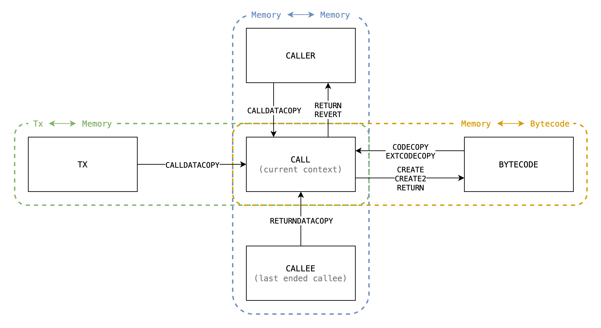

# Multi-Step Implementation

<!-- toc -->

# Introduction

In EVM, there are serveral opcodes moving dynamic-length bytes around between different sources, here is a complete list:

    
<table>
<thead>
<tr>
<th>Type</th>
<th>Opcode</th>
<th>Source</th>
<th>Destination</th>
</tr>
</thead>
<tbody>
<tr>
<td rowspan="3">1</td>
<td><code>CODECOPY</code> <code>EXTCODECOPY</code></td>
<td><code>bytecode[code_hash]</code></td>
<td><code>calls[call_id].memory</code></td>
</tr>
<tr>
<td><code>CALLDATACOPY and is_root</code></td>
<td><code>txs[tx_id].calldata</code></td>
<td><code>calls[call_id].memory</code></td>
</tr>
<tr>
<td><code>CALLDATACOPY and not_root</code></td>
<td><code>calls[caller_call_id].memory</code></td>
<td><code>calls[call_id].memory</code></td>
</tr>
<tr>
<td>2</td>
<td><code>RETURNDATACOPY</code></td>
<td><code>calls[callee_call_id].memory</code></td>
<td><code>calls[call_id].memory</code></td>
</tr>
<tr>
<td rowspan="2">3</td>
<td><code>RETURN and is_create</code> <code>CREATE</code> <code>CREATE2</code></td>
<td><code>calls[call_id].memory</code></td>
<td><code>bytecode[code_hash]</code></td>
</tr>
<tr>
<td><code>SHA3</code></td>
<td><code>calls[call_id].memory</code></td>
<td>TBD</td>
</tr>
<tr>
<td rowspan="2">4</td>
<td><code>RETURN and not_create</code></td>
<td><code>calls[call_id].memory</code></td>
<td><code>calls[caller_call_id].memory</code></td>
</tr>
<tr>
<td><code>REVERT and not_create</code></td>
<td><code>calls[call_id].memory</code></td>
<td><code>calls[caller_call_id].memory</code></td>
</tr>
</tbody>
</table>

With illustration:

There could be classified to be 4 types:

1. `* -> memory (padding)`
    - Including:
        - `CALLDATACOPY`
        - `CODECOPY`
        - `EXTCODECOPY`
    - Copy from calldata or code to current memory.
    - Memory gets filled with 0's when copied out of source's range, in other words, source is padded with 0's to the range.
2. `* -> memory (no padding)`
    - Including `RETURNDATACOPY`.
    - Similar to Type 1, but the range is explicitly checked to be in source's range, otherwise the EVM halts with exception. So no padding issue.
3. `memory -> * (no range capped)`
    - Including:
        - `RETURN` when `is_create`
        - `CREATE`
        - `CREATE2`
        - `SHA3`
    - Copy from current memory to destination.
    - No padding issue since memory is always expanded implicitly due to lazy initialization.
4. `memory -> * (range capped)`
    - Including:
        - `RETURN` when `not_create`
        - `REVERT` when `not_create`
    - Similar to Type 3, but the range is capped by caller's assignment.

## Approaches

### Approach #1 - Given access to previous step

Take `CALLDATALOAD` as an example, in the [approach](https://github.com/appliedzkp/zkevm-specs/blob/2864c3f0f6cb905b8548da9cde76fea13a42085f/src/zkevm_specs/evm/execution_result/calldatacopy.py) by @icemelon, it requires access to previous step to infer what's the state of current step, to know if the step is the first step, we check

1. `curr.opcode == CALLDATALOAD`
2. `prev.execution_state != CALLDATALOAD or prev.finished is True`

And it transit the `StepState` at the last step, which is inferred from if the bytes left to copy is less then a step's amount.

### Approach #2 - Introduce internal `ExecutionState`

This approach introduce internal `ExecutionState` with extra constraint of `ExecutionState` transition, and the inputs will be passed by constraint from previous step. The new `ExecutionState` are:

- `CopyMemoryToMemory`
    - Can only transited from:
        - `RETURN`
        - `REVERT`
        - `CALLDATACOPY`
        - `RETURNDATACOPY`
    - Inputs:
        - `src_call_id` - id of source call (to be read)
        - `dst_call_id` - id of destination call (to be written)
        - `src_end` - end of source, it returns `0` when indexing out of this.
        - `src_offset` - memory offset of source call
        - `dst_offset` - memory offset of destination call
        - `bytes_left` - how many bytes left to copy
    - Note:
        - The `src_end` is only used by `CALLDATACOPY` since only it needs padding.
- `CopyTxCalldataToMemory`
    - Can only transited from `CALLDATACOPY`
    - Inputs:
        - `tx_id` - id of current tx
        - `src_end` - end of source, it returns `0` when indexing out of this
        - `src_offset` - calldata offset of tx
        - `dst_offset` - memory offset of current call
        - `bytes_left` - how many bytes left to copy

- `CopyBytecodeToMemory`
    - Can only transited from:
        - `CODECOPY`
        - `EXTCODECOPY`
    - Inputs:
        - `code_hash` - hash of bytecode
        - `src_end` - end of source, it returns `0` when indexing out of this
        - `src_offset` - calldata offset of tx
        - `dst_offset` - memory offset of current call
        - `bytes_left` - how many bytes left to copy

- `CopyMemoryToBytecode`
    - Can only transited from:
        - `CREATE` - copy init code
        - `CREATE2` - copy init code
        - `RETURN` - copy deployment code
    - Inputs:
        - `code_hash` - hash of bytecode
        - `src_offset` - calldata offset of tx
        - `dst_offset` - memory offset of current call
        - `bytes_left` - how many bytes left to copy
    - Note
        - This differs from `CopyBytecodeToMemory` in that it doesn't have padding.

> If we can have a better way to further generalize these inner `ExecutionState`, we can have less redundant implementation.
>
> **han**

And they do the bytes copy with range check specified by trigger `ExecutionState`.

Also these internal `ExecutionState`s always propagate `StepState`s as the same value, since the transition is already done by the trigger of `ExecutionState`.

Take `CALL` then `CALLDATALOAD` as an example:

- Caller executes `CALL` with stack values (naming referenced from [`instruction.go#L668`](https://github.com/ethereum/go-ethereum/blob/master/core/vm/instructions.go#L668)):
    - `inOffset = 32`
    - `inSize = 32`
- Callee executes `CALLDATALOAD` with stack values (naming referenced from [`instruction.go#L301-L303`](https://github.com/ethereum/go-ethereum/blob/master/core/vm/instructions.go#L301-L303)):
	- `memOffset = 0`
	- `dataOffset = 64`
	- `length = 32`
- The first step of `CopyMemoryToMemory` will receive inputs:
    - `src_call_id = caller_call_id`
    - `dst_call_id = callee_call_id`
    - `src_end = inOffset + inSize = 64`
    - `src_offset = inOffset + dataOffset = 96`
    - `dst_offset = memOffset = 0`
    - `bytes_left = length = 32`

Then, in every step we check if `src_offset < src_end`, if not, we need to disable the source lookup and fill zeros into destination. Then add the `*_offset` by the amount of bytes we process at a step, and subtract `bytes_left` also by it, then propagate them to next step.

## Conclusion

Comparison between the 2 approaches:

- Approach #1
    - Pros
        - No additional `ExecutionState`
    - Cons
        - Each multi-step opcodes will have at least 3 extra nested branches:
            - `is_first` - If the step is the first
            - `not_first` - If the step is n-th step
            - `is_final` - If the step is final
- Approach #2
    - Pros
        - Each multi-step opcodes only need to prepare the inputs of those inner `ExecutionState` and do the correct `StepState` transition.
        - Only 2 nested branches:
            - `not_final` - If the step is n-th step
            - `is_final` - If the step is final
    - Cons
        - Additional `ExecutionState`

In the context of current implementation, approach #2 seems easier to implement due to the separation of complexity, and also less prover effort.

In the context of re-designed EVM circuit (re-use instruction instead of building giant custom gates), it seems no difference on prover effort between the 2 approaches, but approach #2 seems better because it extracts the nested branch and should reduce the usage of rows.

