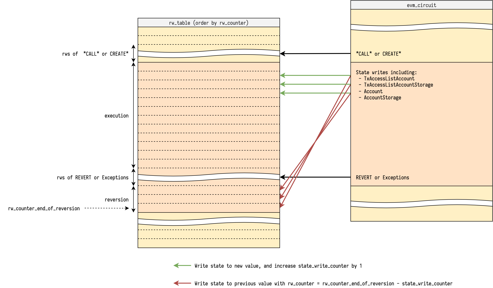
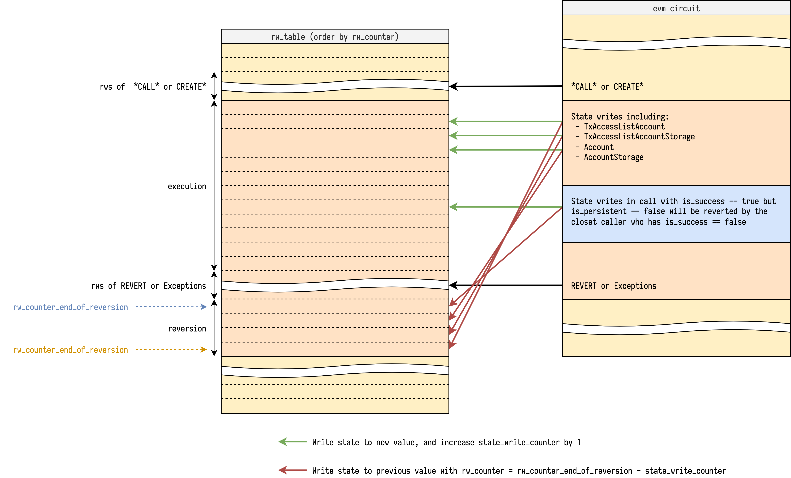

# State Write Reversion

State write reversion might be the most trick part to explain in EVM circuit. This note aims to illustrate how current approach works with some diagrams, and collect all the other approaches for comparison.

## Revert or not

With full execution trace of a block, if we iterate over it once, we can know if each call including create is successful or not, then to determine if which state writes is persistent, others are not.

So each call could be annotated with 2 tag:

- `is_success` - If this call ends with `STOP` or `RETURN`
- `is_persistent` - If this call and all its caller have `is_success == true`

And only state writes inside call with `is_persistent == true` will be applied to the new state, others inside call with `is_persistent == false` will be reverted at the closest call that has `is_success == false`.

## Current approach

Since the only requirement of read/write is `rw_counter` uniqueness, we are not restricted to only do read/write with current `rw_counter`, instead we can do read/write with any `rw_counter`, as long as we don't break the `rw_counter` uniqueness requirement.

Then we ask prover to tell us each call's information including:

- `is_success` - Descirbed above
- `is_persistent` - Descirbed above
- `rw_counter_end_of_reversion` - The `rw_counter` at the end of reversion of a call if it has `is_persistent == false`

And in EVM circuit we track another value `state_write_counter` to count how many state writes have been made so far, and it's initialized at `0` of each call.

With `is_persistent`, `rw_counter_end_of_reversion` and `state_write_counter`, we can do state write with its reversion at the same step, because we know at which point it should happen. The pseudo code of state write looks like:

```python
rw_table.lookup(
    rw_counter=rw_counter,
    state_write=state_write, # write to new value
)

if not is_persistent:
    rw_table.lookup(
        rw_counter=rw_counter_end_of_reversion - state_write_counter,
        state_write=state_write.reverted(), # write to previous value
    )

rw_counter += 1
state_write_counter += 1
```

Note that the we are increasing the `state_write_counter`, so the reversions are applied reversely in `rw_table`, which is exact the behavior we want.

Another important check is to ensure `rw_counter_end_of_reversion` is reasonable. At the step that does the reversions, it will check if there is a gap of `rw_counter` to the next step, where the gap size is exact the `state_write_counter`. And in the end of the gap, the `rw_counter` is exact `rw_counter_end_of_reversion`. The pseudo code looks like:

```python
if not is_persistent:
    assert rw_counter_end_of_reversion == rw_counter + state_write_counter
    rw_counter = call.rw_counter_end_of_reversion + 1
```

With illustration:



And the step that does the reversions is also responsible for reversions of its successful callees. Note that each callee's `state_write_counter` is initialized at `0`, to make sure they can do the reversion at correct `rw_counter`, we need to propagate the `rw_counter_end_of_reversion` to be the one minus current accumulated `state_write_counter`. The pseudo code looks like:

```python
if not is_persistent and callee_is_success:
    assert callee_rw_counter_end_of_reversion \
        == rw_counter_end_of_reversion - state_write_counter
```



And at the end of successful callee, we accumulate the `state_write_counter` to its caller.

### Adjustment for `SELFDESTRUCT`

See [Design Notes, State Write Reversion Note2, SELFDESTRUCT](./state-write-reversion2.md#selfdestruct)

## Other approaches

### With `revision_id`

TODO
