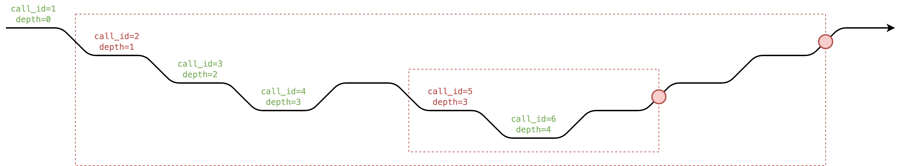

# State Write Reversion Note 2

# ZKEVM - State Circuit Extension - `StateDB`

## Reversion

In EVM, there are multiple kinds of `StateDB` update could be reverted when any internal call fails. 

- `tx_access_list_account` - `(tx_id, address) -> accessed`
- `tx_access_list_storage_slot` - `(tx_id, address, storage_slot) -> accessed`
- `account_nonce` - `address -> nonce`
- `account_balance` - `address -> balance`
- `account_code_hash` - `address -> code_hash`
- `account_storage` - `(address, storage_slot) -> storage`

The complete list could be found [here](https://github.com/ethereum/go-ethereum/blob/master/core/state/journal.go#L87-L141). Some of them like `tx_refund`, `tx_log`, `account_destructed` we don't need to write and revert because it doesn't affect future execution, we only write them when `is_persistent=1`.

### Visualization

- Black arrow represents the time, which is composed by points of sequential `global_counter`.
- Red circle represents the revert section.

Those actions write `StateDB` inside red box will also revert itself in revert section (red circle), but in reverse order.

Each call needs to know its `global_counter_end_of_revert_section` to revert with the correct `global_counter`. If callee is a success call but in some red box (`is_persistent=0`), we need to copy caller's `global_counter_end_of_revert_section` and `state_db_write_counter` to callee's.

## `SELFDESTRUCT`

The opcode `SELFDESTRUCT` set `is_destructed` of the account, but before that transaction ends, the account still can be executed, receive ether, and access storage as usual. The `is_destructed` only takes effect only after a transaction ends.

In detail, the state trie gets finalized each transaction, and only when state trie gets finalized the account would be actually deleted. After the `SELFDESTRUCT` transaction finalized, the further transactions treat the account as an empty account.

> So if some contract executed `SELFDESTRUCT` but then receive some ether, those ether will vanish into thin air after the transaction is finalized. Soooo weird.
>
> **han**

The `SELFDESTRUCT` is powerful that could affect many state at a time including:

- `account_nonce`
- `account_balance`
- `account_code_hash`
- all slot of `account_storage`

The first 3 value is relatively easier to handle in circuit, we could track an extra `selfdestruct_counter` and `global_counter_end_of_tx` and set them to empty value at `global_counter_end_of_tx - selfdestruct_counter`, which just like how we handle revert.

However, the `account_storage` is tricky because we don't track the storage trie value and update it after each transaction, instead we only track each used slot in storage trie and update the storage trie after the whole block.

### Workaround for consistency check

It seems that we need to annotate each account a `revision_id`, and the `revision_id` increases only when `is_destructed` is set and `tx_id` changes. With the different `revision_id`, we can reset the values in State circuit for `nonce`, `balance`, `code_hash`, and each `storage` just like how we initialize the memroy.

So `address -> is_destructed` becomes `(tx_id, address) -> (revision_id, is_destructed)`.

And then we add an extra `revision_id` to `nonce`, `balance`, `code_hash` and `storage`. For `nonce`, `balance` and `code_hash` we group them by `(address, revision_id) -> {nonce,balance,code_hash}`, for `storage` we group them by `(address, storage_slot, revision_id) -> storage`.

Here is an example of `account_balance` with `revision_id`:

$$
\begin{array}{|c|c|}
\hline
\texttt{address} & \texttt{revision_id} & \texttt{gc} & \texttt{balance} & \texttt{balance_prev} & \texttt{is_write} & \text{note} \\\\\hline
\color{#aaa}{\texttt{0xfd}} & \color{#aaa}{\texttt{-}} & \color{#aaa}{\texttt{-}} & \color{#aaa}{\texttt{-}} & \color{#aaa}{\texttt{-}} & \color{#aaa}{\texttt{-}} \\\\\hline
\texttt{0xfe} & \texttt{1} & \color{#aaa}{\texttt{x}} & \texttt{10} & \color{#aaa}{\texttt{x}} & \texttt{1} & \text{open from trie} \\\\\hline
\texttt{0xfe} & \texttt{1} & \texttt{23} & \texttt{20} & \texttt{10} & \texttt{1} \\\\\hline
\texttt{0xfe} & \texttt{1} & \texttt{45} & \texttt{20} & \texttt{20} & \texttt{0} \\\\\hline
\texttt{0xfe} & \texttt{1} & \texttt{60} & \texttt{0} & \texttt{20} & \texttt{1} \\\\\hline
\texttt{0xfe} & \color{#f00}{\texttt{1}} & \texttt{63} & \texttt{5} & \texttt{0} & \texttt{1} \\\\\hline
\texttt{0xfe} & \color{#f00}{\texttt{2}} & \color{#aaa}{\texttt{x}} & \color{#f00}{\texttt{0}} & \color{#aaa}{\texttt{x}} & \texttt{1} & \text{reset} \\\\\hline
\texttt{0xfe} & \texttt{2} & \texttt{72} & \texttt{0} & \texttt{0} & \texttt{0} \\\\\hline
\color{#aaa}{\texttt{0xff}} & \color{#aaa}{\texttt{-}} & \color{#aaa}{\texttt{-}} & \color{#aaa}{\texttt{-}} & \color{#aaa}{\texttt{-}} & \color{#aaa}{\texttt{-}} \\\\\hline
\end{array}
$$

Note that after contract selfdestructs, it can still receive ether, but the ether will vanish into thin air after transaction gets finalized. The reset is like the lazy initlization of memory, **it set the value to `0` when `revision_id` is different**.

Here is how we increase the `revision_id`:

$$
\begin{array}{|c|c|}
\hline
\texttt{address} & \texttt{tx_id} & \texttt{gc} & \texttt{revision_id} & \texttt{is_destructed} & \texttt{is_destructed_prev} & \texttt{is_write} & \text{note} \\\\\hline
\color{#aaa}{\texttt{0xfd}} & \color{#aaa}{\texttt{-}} & \color{#aaa}{\texttt{-}} & \color{#aaa}{\texttt{-}} & \color{#aaa}{\texttt{-}} & \color{#aaa}{\texttt{-}} & \color{#aaa}{\texttt{-}} \\\\\hline
\texttt{0xff} & \texttt{1} & \color{#aaa}{\texttt{x}} & \texttt{1} & \texttt{0} & \color{#aaa}{\texttt{x}} & \texttt{1} & \text{init} \\\\\hline
\texttt{0xff} & \texttt{1} & \texttt{11} & \texttt{1} & \texttt{0} & \texttt{0} & \texttt{0} \\\\\hline
\texttt{0xff} & \texttt{1} & \texttt{17} & \texttt{1} & \texttt{1} & \texttt{0} & \texttt{1} & \text{self destruct} \\\\\hline
\texttt{0xff} & \color{#f00}{\texttt{1}} & \texttt{29} & \texttt{1} & \color{#f00}{\texttt{1}} & \texttt{1} & \texttt{1} & \text{self destruct again} \\\\\hline
\texttt{0xff} & \color{#f00}{\texttt{2}} & \color{#aaa}{\texttt{x}} & \color{#f00}{\texttt{2}} & \texttt{0} & \color{#aaa}{\texttt{x}} & \texttt{1} & \text{increase} \\\\\hline
\texttt{0xff} & \texttt{2} & \texttt{40} & \texttt{2} & \texttt{0} & \texttt{0} & \texttt{0} \\\\\hline
\texttt{0xff} & \texttt{3} & \color{#aaa}{\texttt{x}} & \texttt{2} & \texttt{0} & \color{#aaa}{\texttt{x}} & \texttt{1} & \text{no increase} \\\\\hline
\color{#aaa}{\texttt{0xff}} & \color{#aaa}{\texttt{-}} & \color{#aaa}{\texttt{-}} & \color{#aaa}{\texttt{-}} & \color{#aaa}{\texttt{-}} & \color{#aaa}{\texttt{-}} & \color{#aaa}{\texttt{-}} \\\\\hline
\end{array}
$$

Becasue self destruct only takes effect after transaction, so we **increase the `revision_id` only when `tx_id` is different and `is_destructed` is set**.

### Workaround for trie update

The State circuit not only checks consistency, it also triggers the update of the storage tries and state trie.

Originally, some part of State circuit would assign the first row value and collect the last row value of each account's `nonce`, `balance`, `code_hash` and the first & last used slots of storage, then update the state trie.

With `revision_id`, it needs to peek the final `revision_id` first, and collect the last row value with the `revision_id` to make sure all values are actually reset.

## Reference

- [`journal.go`](https://github.com/ethereum/go-ethereum/blob/master/core/state/journal.go)
- [Pragmatic destruction of `SELFDESTRUCT`](https://hackmd.io/@vbuterin/selfdestruct#SELFDESTRUCT-is-the-only-opcode-that-breaks-important-invariants)
